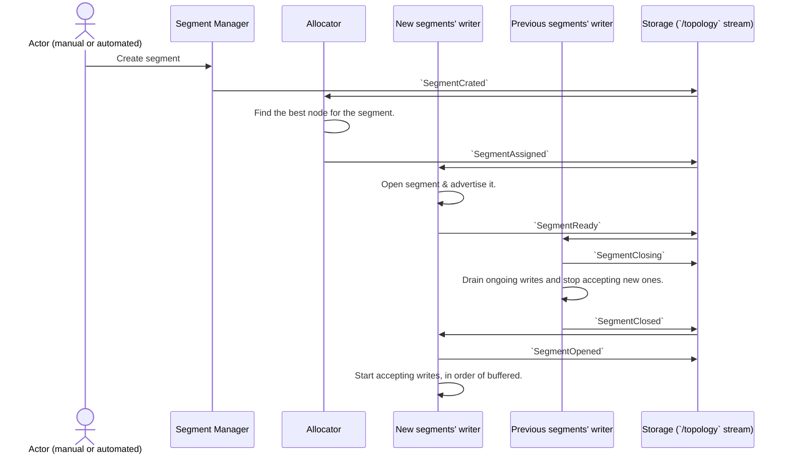
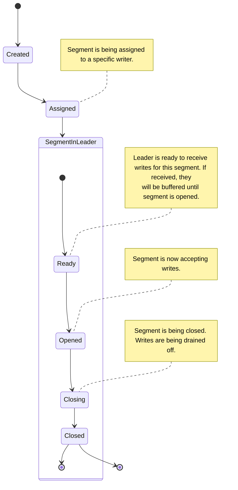

# ADR 4: Multi-writers

## Context

- Having to rely on FoundationDB's `versionstamps` is subpar.

  1. We build a strong and direct dependency to FoundationDB's feature, which doesn't have equivalent in other KV stores
  on the market. While this might have been fine if FDB was a booming open-source project, I have a number of 
  doubts regarding Apple's commitment to the project: Docker images for M1/M2 don't work for more than 1 year, the
  documentation is particularly bad, and the community is not very active and their latest releases are
  all very much focused (and even name) on Snowflake.
  
  2. It's not clear how to use `versionstamps` in a multi-writers scenario: it is 
  somewhat inevitable that this feature prevents us to scale the number of concurrent writers.

- We need to be able to scale the number of concurrent writers if we want to achieve the scalability that
  Fossil need to be a viable large scale event store, including as a cheap SaaS offering.

## Decision

- We'll prototype and experiment with a technical strategy that support multi-writers on top of KV stores!

## Pieces of the puzzle

1. (segment placement) Ownership of individual stream to a segment, over time.
  - Might be through the prefixes or hash ring.
  - Could we create "key spaces" so it's not just hashes?
2. Each (active) segment/shard is owned (distributed lock) by a single node.
  - This node handles writes. We need to know which one and redirect requests to it.
  - When ownership needs to be changed (rebalancing), segment is closed.
  - Segments are provided a number, which increases over time? Not sure as this means overflows.
  - Raft? https://godoc.org/github.com/lytics/metafora?
3. Each segment has a incremental write “count” (monoatomically incresing)
  - Reading in order for any kind of event query = follow the ownership chain, read in order (through the segment counter) and filter out what’s not relevant.
  - For best read performance, we want segment allocation to be as close as possible to the prefixes so we maximise hit ratio
4. Maintaining a “position cursor” over time needs to take into account all “relevant” segments and the max(counter) for each.
  - We might have to introduce compaction (aka re-create the ownership history) for performance reasons.

### Components

- Segment manager.
  - Assigns/rebalances ownership of open segments to writers.
  - A single Raft log that contains all of the segment changes,
    including member ownership.

- Writer.
  - Receives all of the writes for a set of segments.

# Change of a segment

This sequence diagram represents the process of creating a new segment `NewSegment`, following a previous one (`PreviousSegment`). 

## Segment states

