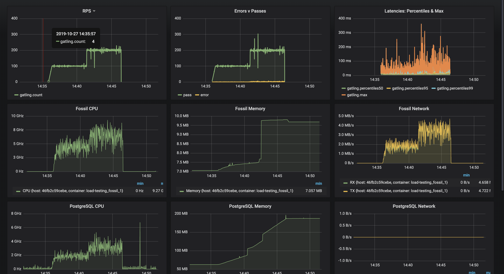

# Load testing 

## Usage

The easiest way to have the full load-testing environment is to run it with Docker. 

1. Configure the testing variables, according to your _assumptions_. Test is divided in multiple categories.

   - `FOSSIL_URL` The URL of Fossil's endpoint
   
   **Collection**
   - `TOTAL_NUMBER_OF_EVENTS` to be collected.
   - `CONCURRENT_COLLECTIONS` for the number of parallel collections.
   - `NUMBER_OF_EVENTS_PER_STREAM` the average number of events per stream

2. Prepare the environment
```
docker-compose up -d
```

3. Run the simulation(s)
```
docker-compose run gatling -rd Fossil
```

## Monitoring

When running the load-testing, you can see the load tests and containers health metrics in Grafana:
http://localhost:3000


