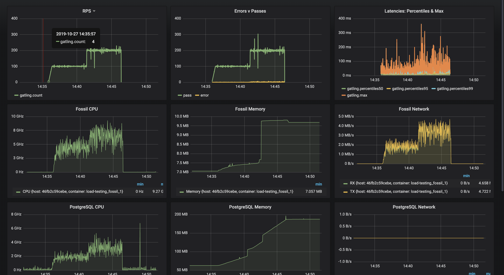

# Load testing 

## Usage

The easiest way to have the full load-testing environment is to run it with Docker. 

1. Configure the testing variables, according to your _assumptions_. Test is divided in multiple categories.

   - `FOSSIL_URL` The URL of Fossil's endpoint
   
   **Collection**
   - `TOTAL_NUMBER_OF_EVENTS` to be collected.
   - `CONCURRENT_COLLECTIONS` for the number of parallel collections.
   - `NUMBER_OF_EVENTS_PER_STREAM` the average number of events per stream

2. Prepare the environment
```
docker-compose up -d
```

3. Run the simulation(s)
```
docker-compose run gatling -rd Fossil
```

## Monitoring

When running the load-testing, you can see the load tests and containers health metrics in Grafana:
http://localhost:3000




## Running the load testing scripts from scratch (CentOS)

This gives you all the commands to run the load testing scripts on a default AWS EC2 machine.

```
sudo yum install docker git
sudo service docker start
sudo curl -L "https://github.com/docker/compose/releases/download/1.24.1/docker-compose-$(uname -s)-$(uname -m)" -o /usr/local/bin/docker-compose
sudo chmod +x /usr/local/bin/docker-compose
sudo ln -s /usr/local/bin/docker-compose /usr/bin/docker-compose

git clone https://github.com/sroze/fossil.git
cd fossil/load-testing

(manually update the `docker-compose.yml` file as per comments)

sudo docker-compose up -d

wget https://bin.equinox.io/c/4VmDzA7iaHb/ngrok-stable-linux-amd64.zip
unzip ngrok-stable-linux-amd64.zip
screen
./ngrok authtoken [...]
# Open the Grafana dashboard
# Ctrl+A d


```